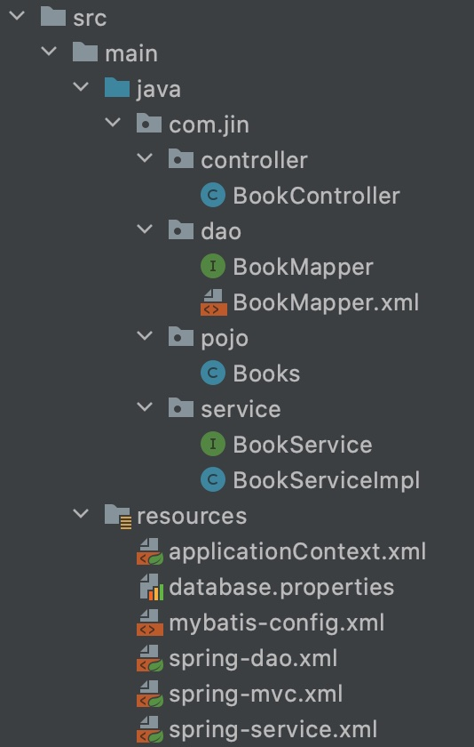
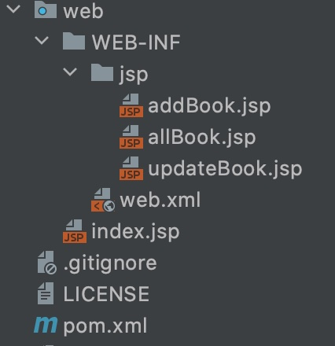
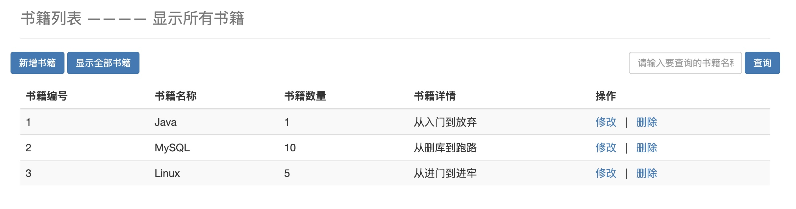
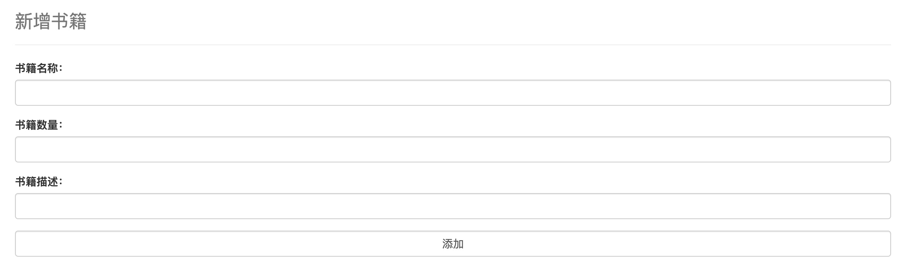

# SSM-practice-a-simple-program-of-books
#### Description

This is a simple practice program of Java web application using SSM-Maven frameworks. It displays a web-app of book collections that allows basic CRUD executions.

#### Environment

* IDEA
* MySQL 8.0
* Tomcat 9
* Maven 3.6

#### Database

MySQL

```mysql
CREATE DATABASE `ssmbuild`;

USE `ssmbuild`;

DROP TABLE IF EXISTS `books`;

CREATE TABLE `books` (
  `bookID` INT(10) NOT NULL AUTO_INCREMENT COMMENT '书id',
  `bookName` VARCHAR(100) NOT NULL COMMENT '书名',
  `bookCounts` INT(11) NOT NULL COMMENT '数量',
  `detail` VARCHAR(200) NOT NULL COMMENT '描述',
  KEY `bookID` (`bookID`)
) ENGINE=INNODB DEFAULT CHARSET=utf8;

INSERT  INTO `books`(`bookID`,`bookName`,`bookCounts`,`detail`)VALUES 
(1,'Java',1,'从入门到放弃'),
(2,'MySQL',10,'从删库到跑路'),
(3,'Linux',5,'从进门到进牢');
```

#### Dependencies

```xml
<dependencies>
    <!--Junit-->
    <dependency>
        <groupId>junit</groupId>
        <artifactId>junit</artifactId>
        <version>4.13</version>
        <scope>test</scope>
    </dependency>
    <!--DB driver-->
    <dependency>
        <groupId>mysql</groupId>
        <artifactId>mysql-connector-java</artifactId>
        <version>8.0.23</version>
    </dependency>
    <!--DB connection pool: c3p0-->
    <dependency>
        <groupId>com.mchange</groupId>
        <artifactId>c3p0</artifactId>
        <version>0.9.5.2</version>
    </dependency>
    <!--Servlet - JSP -->
    <dependency>
        <groupId>javax.servlet</groupId>
        <artifactId>servlet-api</artifactId>
        <version>2.5</version>
    </dependency>
    <dependency>
        <groupId>javax.servlet.jsp</groupId>
        <artifactId>jsp-api</artifactId>
        <version>2.2</version>
    </dependency>
    <dependency>
        <groupId>javax.servlet</groupId>
        <artifactId>jstl</artifactId>
        <version>1.2</version>
    </dependency>
    <!--Mybatis-->
    <dependency>
        <groupId>org.mybatis</groupId>
        <artifactId>mybatis</artifactId>
        <version>3.5.6</version>
    </dependency>
    <dependency>
        <groupId>org.mybatis</groupId>
        <artifactId>mybatis-spring</artifactId>
        <version>2.0.6</version>
    </dependency>
    <!--Spring-->
    <dependency>
        <groupId>org.springframework</groupId>
        <artifactId>spring-webmvc</artifactId>
        <version>5.2.14.RELEASE</version>
    </dependency>
    <dependency>
        <groupId>org.springframework</groupId>
        <artifactId>spring-jdbc</artifactId>
        <version>5.2.14.RELEASE</version>
    </dependency>
    <!--Lombok-->
    <dependency>
        <groupId>org.projectlombok</groupId>
        <artifactId>lombok</artifactId>
        <version>1.18.16</version>
    </dependency>
</dependencies>
```

#### Structure

Here I used SSM (Spring, SpringMVC, MyBatis) and Maven as frameworks.

The structure of this program is as follows:





#### Function

This program only implemented basic CRUD functions including adding books, deleting books, modifying books, listing books, searching books by name (fuzzy search).

#### Display



